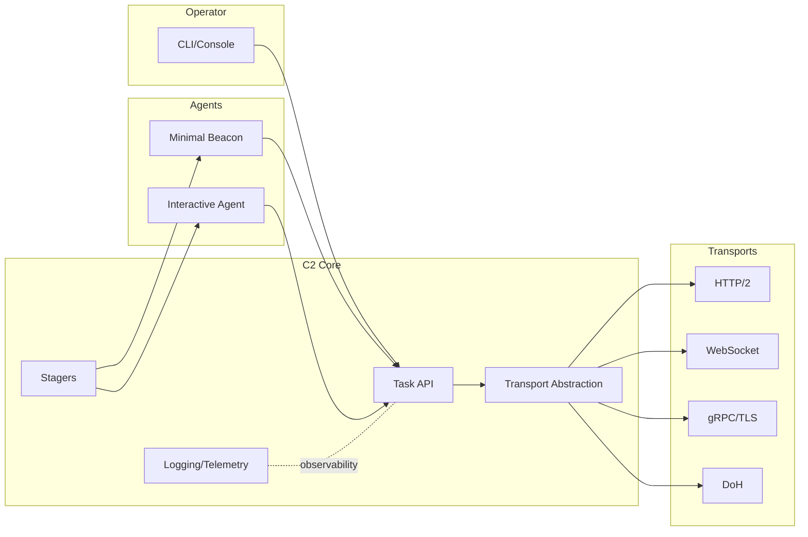

# 🧩 R0n1n

**Red Team Operator · Malware R\&D · Adversary Emulation**

  

  
  
  
  

---

### TL;DR

* Red Team operator building **offensive security research tooling** for **authorized** environments.
* Interests: **implant design**, **C2 transports**, **opsec**, **artifact minimization**, **post‑ex**, **telemetry shaping**.
* I ship small, composable tools and document trade‑offs.

### ⚗️ Selected Research / Tools

> Swap in your repo links when ready.

* **Operator Lab** — Private repo of PoCs for transport, staging, and OPSEC experiments.
* **WS Relay** — WebSocket man‑in‑the‑middle for testing auth/session edge cases.
* **Distributed Scanner** — RabbitMQ‑backed fan‑out scan framework (workers 1..N).
* **C2 Sandbox** — Modular C2 research playground (protocol adapters & handlers).

### 🧠 Design Snapshot

### 🛠️ Stack

* **Langs:** Python, Go, Rust, C/C++
* **Infra:** Docker, RabbitMQ, Redis, SQLite/Postgres
* **Targets:** Windows & Linux (userland), containers, cloud endpoints
* **Tooling:** Git, Make/CMake, Poetry/Pipenv, clang, llvm, cmocka

### 📎 Notes on Use

* Research intended for **defensive improvement** and **adversary emulation** in scoped, lawful tests.
* All code: **for authorized security assessments only**. No warranties.
* I practice **operational hygiene**: minimize footprint, isolate risk, and document assumptions.

### 🔐 Trust & Contact

* **PGP:** *add fingerprint*
* **Secure contact:** *add channel (e.g., Matrix, Proton)*
* **Collab:** Open to research collabs w/ clear scope.

### 📌 Quick Start (Profile README)

This file should live at `github.com/<your‑username>/<your‑username>` so it renders on your profile. Pin 3–6 repos for visibility.

---

Badges are via shields.io. Replace placeholders when your repos go public.
